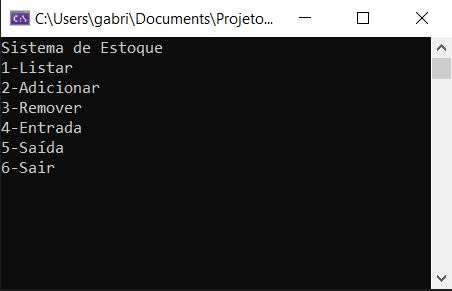
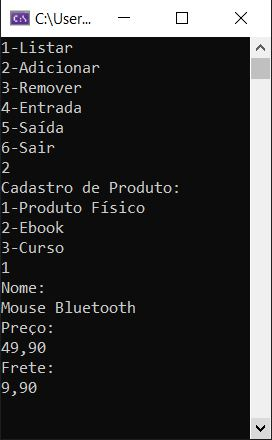
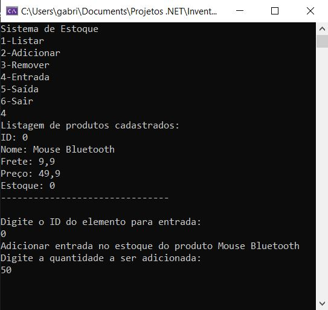
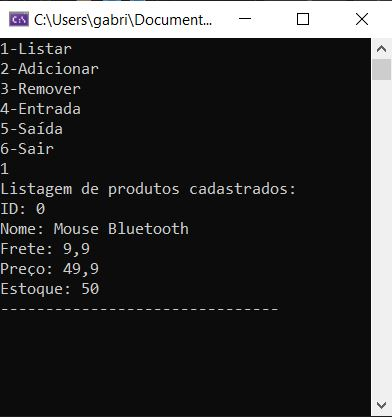

# Inventory Manager

Console application developed in **C#** using **Object-Oriented Programming (OOP)** principles to manage an inventory of physical and digital products.

## About the Project

This project was created to practice software architecture, OOP concepts, and data persistence in .NET.

The system allows the user to:

- List registered products
- Add new products (Physical Product, Ebook, Course)
- Remove products
- Register stock entry and exit
- Persist data locally

## Architecture

The project is organized using separation of responsibilities:

InventoryManager

- Interfaces → Contracts used by the system
- Models → Domain entities (Product, Ebook, Course, etc.)
- Services → Business logic and system flow
- Program.cs → Application entry point

This structure follows common **layered architecture** practices used in real-world software projects.

## OOP Concepts Applied

- Inheritance
- Interfaces
- Encapsulation
- Polymorphism
- Separation of concerns

## Data Persistence

Product data is serialized and stored locally to maintain state between executions.

## System Preview

- Menu list:

- Product Registration:

- Stock Entry:

- Product Listing:

## Author

**Gabriel Campanha**

---

Feel free to explore the code and provide feedback.
